# ERD

```mermaid
erDiagram
    USER ||--|| USER_PROFILE : has
    USER ||--o{ USER_CAMPUS : affiliated_with
    CAMPUS ||--o{ USER_CAMPUS : assigned

    USER ||--o{ USER_TARGET : sets
    USER ||--o{ USER_ALLERGY : has
    ALLERGY_MASTER ||--o{ USER_ALLERGY : defines
    USER ||--o{ WEIGHT_LOG : tracks

    CAMPUS ||--o{ DINING_HALL : has
    DINING_HALL ||--o{ DINING_MENU : publishes
    DINING_MENU ||--o{ DINING_MENU_ITEM : includes

    FOOD ||--o{ FOOD_ALIAS : has
    FOOD ||--o{ FOOD_ALLERGY : may_contain
    ALLERGY_MASTER ||--o{ FOOD_ALLERGY : defines

    FOOD ||--o{ FOOD_CATEGORY_MAP : classified_as
    FOOD_CATEGORY ||--o{ FOOD_CATEGORY_MAP : maps

    FOOD ||--o{ FOOD_INGREDIENT : composed_of
    INGREDIENT_MASTER ||--o{ FOOD_INGREDIENT : defines

    FOOD ||--o{ FOOD_NUTRIENT : has
    NUTRIENT_MASTER ||--o{ FOOD_NUTRIENT : defines

    DINING_MENU_ITEM ||--o{ MENU_ITEM_FOOD_MAP : decomposes
    FOOD ||--o{ MENU_ITEM_FOOD_MAP : maps_to

    DINING_MENU_ITEM ||--o{ MENU_ITEM_ALLERGY : has
    ALLERGY_MASTER ||--o{ MENU_ITEM_ALLERGY : defines

    DINING_MENU_ITEM ||--o{ MENU_ITEM_INGREDIENT : has
    INGREDIENT_MASTER ||--o{ MENU_ITEM_INGREDIENT : defines

    DINING_MENU_ITEM ||--o{ MENU_ITEM_NUTRIENT : has
    NUTRIENT_MASTER ||--o{ MENU_ITEM_NUTRIENT : defines

    USER ||--o{ MEAL_LOG : records
    MEAL_LOG ||--o{ MEAL_LOG_ITEM : contains
    FOOD ||--o{ MEAL_LOG_ITEM : logged_as
    DINING_MENU_ITEM ||--o{ MEAL_LOG_ITEM : logged_as

    MEAL_LOG ||--o| MEAL_FEEDBACK : analyzed_as
    USER ||--o{ MEAL_FEEDBACK : receives
    USER_TARGET ||--o{ MEAL_FEEDBACK : based_on
    MEAL_FEEDBACK ||--o{ MEAL_FEEDBACK_DETAIL : contains
    MEAL_FEEDBACK ||--o{ NEXT_MEAL_GUIDE : suggests
    FOOD ||--o{ NEXT_MEAL_GUIDE : recommends
    DINING_MENU_ITEM ||--o{ NEXT_MEAL_GUIDE : recommends

    USER ||--o{ MENU_RECOMMENDATION : receives
    USER_TARGET ||--o{ MENU_RECOMMENDATION : based_on
    DINING_MENU_ITEM ||--o{ MENU_RECOMMENDATION : recommends
    MENU_RECOMMENDATION ||--o{ MENU_RECOMMENDATION_REASON : explained_by

    USER ||--o{ WEEKLY_FEEDBACK : receives
    USER_TARGET ||--o{ WEEKLY_FEEDBACK : evaluated_by
    WEEKLY_FEEDBACK ||--o{ WEEKLY_FEEDBACK_DETAIL : contains

    USER {
        bigint user_id PK
        string email
        string password_hash
        string name
        string status
        datetime created_at
        datetime last_login_at
    }

    USER_PROFILE {
        bigint user_id PK,FK
        date birth_date
        string gender
        decimal height_cm
        decimal current_weight_kg
        string activity_level
        datetime updated_at
    }

    CAMPUS {
        bigint campus_id PK
        string campus_name
        string region
    }

    USER_CAMPUS {
        bigint user_campus_id PK
        bigint user_id FK
        bigint campus_id FK
        boolean is_primary_yn
        date effective_from
        date effective_to
    }

    USER_TARGET {
        bigint target_id PK
        bigint user_id FK
        string goal_type
        decimal start_weight_kg
        decimal target_weight_kg
        int target_calorie_kcal
        decimal target_carb_g
        decimal target_protein_g
        decimal target_fat_g
        int sodium_limit_mg
        string status
        date effective_from
        date effective_to
        datetime achieved_at
        datetime created_at
        datetime updated_at
    }

    ALLERGY_MASTER {
        bigint allergy_id PK
        string allergy_code
        string allergy_name
        string allergy_group
        string description
    }

    USER_ALLERGY {
        bigint user_allergy_id PK
        bigint user_id FK
        bigint allergy_id FK
        string severity_level
        string note
        datetime created_at
    }

    FOOD {
        bigint food_id PK
        string source_name
        string source_food_code
        string food_name
        string source_food_category
        decimal serving_size_g
        int calories_kcal
        decimal carb_g
        decimal protein_g
        decimal fat_g
        int sodium_mg
        decimal sugar_g
        decimal dietary_fiber_g
        decimal saturated_fat_g
        decimal trans_fat_g
        int cholesterol_mg
        string default_image_url
    }

    FOOD_ALIAS {
        bigint alias_id PK
        bigint food_id FK
        string alias_name
        string normalized_alias
        string alias_type
        int priority
    }

    FOOD_CATEGORY {
        bigint category_id PK
        string category_code
        string category_name
        string icon_url
        string image_url
        int sort_order
    }

    FOOD_CATEGORY_MAP {
        bigint food_category_map_id PK
        bigint food_id FK
        bigint category_id FK
        boolean is_primary_yn
    }

    INGREDIENT_MASTER {
        bigint ingredient_id PK
        string ingredient_name
        string normalized_name
        string ingredient_group
    }

    FOOD_INGREDIENT {
        bigint food_ingredient_id PK
        bigint food_id FK
        bigint ingredient_id FK
        decimal amount_g
        boolean is_major_yn
    }

    FOOD_ALLERGY {
        bigint food_allergy_id PK
        bigint food_id FK
        bigint allergy_id FK
        string risk_type
    }

    NUTRIENT_MASTER {
        bigint nutrient_id PK
        string nutrient_code
        string nutrient_name
        string unit
        string nutrient_group
    }

    FOOD_NUTRIENT {
        bigint food_nutrient_id PK
        bigint food_id FK
        bigint nutrient_id FK
        decimal amount_value
        decimal basis_amount_g
    }

    DINING_HALL {
        bigint dining_hall_id PK
        bigint campus_id FK
        string hall_name
        string hall_type
        string location
        string operating_status
    }

    DINING_MENU {
        bigint menu_id PK
        bigint dining_hall_id FK
        date menu_date
        string meal_type
        string source_name
        datetime uploaded_at
    }

    DINING_MENU_ITEM {
        bigint menu_item_id PK
        bigint menu_id FK
        string menu_name
        decimal price
        decimal serving_size_g
        int calories_kcal
        decimal carb_g
        decimal protein_g
        decimal fat_g
        int sodium_mg
        decimal sugar_g
        decimal dietary_fiber_g
        decimal saturated_fat_g
        decimal trans_fat_g
        int cholesterol_mg
        boolean sold_out_yn
    }

    MENU_ITEM_FOOD_MAP {
        bigint map_id PK
        bigint menu_item_id FK
        bigint food_id FK
        decimal portion_ratio
        decimal mapping_confidence
    }

    MENU_ITEM_ALLERGY {
        bigint menu_item_allergy_id PK
        bigint menu_item_id FK
        bigint allergy_id FK
        string source_type
    }

    MENU_ITEM_INGREDIENT {
        bigint menu_item_ingredient_id PK
        bigint menu_item_id FK
        bigint ingredient_id FK
        decimal amount_g
        boolean is_estimated_yn
    }

    MENU_ITEM_NUTRIENT {
        bigint menu_item_nutrient_id PK
        bigint menu_item_id FK
        bigint nutrient_id FK
        decimal amount_value
        decimal basis_amount_g
    }

    MEAL_LOG {
        bigint meal_log_id PK
        bigint user_id FK
        date log_date
        string meal_type
        string memo
        datetime created_at
        datetime updated_at
    }

    MEAL_LOG_ITEM {
        bigint meal_log_item_id PK
        bigint meal_log_id FK
        bigint food_id FK
        bigint menu_item_id FK
        string entry_source
        string item_name_snapshot
        decimal intake_ratio
        decimal intake_g
        int calories_kcal
        decimal carb_g
        decimal protein_g
        decimal fat_g
        int sodium_mg
        decimal sugar_g
        decimal dietary_fiber_g
    }

    MEAL_FEEDBACK {
        bigint meal_feedback_id PK
        bigint meal_log_id FK
        bigint user_id FK
        bigint target_id FK
        datetime generated_at
        int overall_score
        string summary
        string next_focus
    }

    MEAL_FEEDBACK_DETAIL {
        bigint meal_feedback_detail_id PK
        bigint meal_feedback_id FK
        string nutrient_type
        string status
        decimal actual_value
        decimal target_value
        string feedback_message
    }

    NEXT_MEAL_GUIDE {
        bigint next_meal_guide_id PK
        bigint meal_feedback_id FK
        string next_meal_type
        string suggestion_type
        bigint recommended_food_id FK
        bigint recommended_menu_item_id FK
        string message
        int priority
    }

    MENU_RECOMMENDATION {
        bigint recommendation_id PK
        bigint user_id FK
        bigint target_id FK
        bigint menu_item_id FK
        date recommended_for_date
        datetime recommended_at
        string meal_type
        string recommendation_status
        boolean allergy_conflict_yn
        int recommendation_score
        int rank_order
        string reason_summary
    }

    MENU_RECOMMENDATION_REASON {
        bigint recommendation_reason_id PK
        bigint recommendation_id FK
        string reason_type
        string metric_name
        decimal current_value
        decimal target_value
        decimal contribution_score
        string reason_message
    }

    WEIGHT_LOG {
        bigint weight_log_id PK
        bigint user_id FK
        datetime measured_at
        decimal weight_kg
        string source_type
        string note
        datetime created_at
    }

    WEEKLY_FEEDBACK {
        bigint feedback_id PK
        bigint user_id FK
        bigint target_id FK
        date week_start_date
        date week_end_date
        int days_logged
        int total_calories_kcal
        decimal week_start_weight_kg
        decimal week_end_weight_kg
        decimal weight_change_kg
        string overall_comment
        datetime created_at
    }

    WEEKLY_FEEDBACK_DETAIL {
        bigint feedback_detail_id PK
        bigint feedback_id FK
        string nutrient_type
        string status
        decimal actual_value
        decimal target_value
        string feedback_message
        string action_guide
    }
```

## 권장 무결성 제약 조건

- `USER.email`: `UNIQUE (email)`
- `USER_PROFILE`: `PRIMARY KEY (user_id)`
- `USER_CAMPUS`: `CHECK (effective_to IS NULL OR effective_to >= effective_from)`
- `USER_CAMPUS`: `UNIQUE (user_id, campus_id, effective_from)`
- `USER_TARGET`: `CHECK (effective_to IS NULL OR effective_to >= effective_from)`
- `USER_TARGET`: 사용자별 `ACTIVE` 목표 1건만 허용 (Partial Unique Index 권장)
- `USER_ALLERGY`: `UNIQUE (user_id, allergy_id)`
- `FOOD_ALIAS`: `UNIQUE (food_id, normalized_alias)`
- `FOOD_CATEGORY.category_code`: `UNIQUE (category_code)`
- `FOOD_CATEGORY_MAP`: `UNIQUE (food_id, category_id)`
- `FOOD_CATEGORY_MAP`: 음식별 `is_primary_yn = true`는 1건만 허용 (Partial Unique Index 권장)
- `INGREDIENT_MASTER.normalized_name`: `UNIQUE (normalized_name)`
- `NUTRIENT_MASTER.nutrient_code`: `UNIQUE (nutrient_code)`
- `FOOD_NUTRIENT`: `UNIQUE (food_id, nutrient_id)`
- `DINING_MENU`: `UNIQUE (dining_hall_id, menu_date, meal_type)`
- `DINING_MENU_ITEM`: `UNIQUE (menu_id, menu_name)`
- `MENU_ITEM_FOOD_MAP`: `UNIQUE (menu_item_id, food_id)`
- `MENU_ITEM_ALLERGY`: `UNIQUE (menu_item_id, allergy_id)`
- `MENU_ITEM_INGREDIENT`: `UNIQUE (menu_item_id, ingredient_id)`
- `MENU_ITEM_NUTRIENT`: `UNIQUE (menu_item_id, nutrient_id)`
- `MEAL_LOG`: `UNIQUE (user_id, log_date, meal_type)`
- `MEAL_LOG_ITEM`: `CHECK ((food_id IS NULL) <> (menu_item_id IS NULL))`
- `MEAL_FEEDBACK`: `UNIQUE (meal_log_id)`
- `NEXT_MEAL_GUIDE`: `CHECK (recommended_food_id IS NOT NULL OR recommended_menu_item_id IS NOT NULL)`
- `WEEKLY_FEEDBACK`: `UNIQUE (user_id, week_start_date, week_end_date)`
