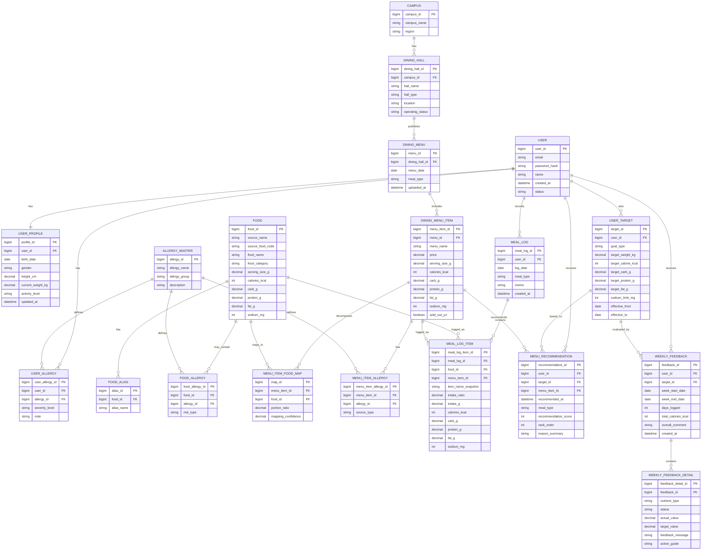

# ERD

```mermaid
erDiagram
    USER ||--|| USER_PROFILE : has
    USER ||--o{ USER_TARGET : sets
    USER ||--o{ USER_ALLERGY : has
    ALLERGY_MASTER ||--o{ USER_ALLERGY : defines

    FOOD ||--o{ FOOD_ALIAS : has
    FOOD ||--o{ FOOD_ALLERGY : may_contain
    ALLERGY_MASTER ||--o{ FOOD_ALLERGY : defines

    CAMPUS ||--o{ DINING_HALL : has
    DINING_HALL ||--o{ DINING_MENU : publishes
    DINING_MENU ||--o{ DINING_MENU_ITEM : includes
    DINING_MENU_ITEM ||--o{ MENU_ITEM_FOOD_MAP : decomposes
    FOOD ||--o{ MENU_ITEM_FOOD_MAP : maps_to
    DINING_MENU_ITEM ||--o{ MENU_ITEM_ALLERGY : has
    ALLERGY_MASTER ||--o{ MENU_ITEM_ALLERGY : defines

    USER ||--o{ MEAL_LOG : records
    MEAL_LOG ||--o{ MEAL_LOG_ITEM : contains
    FOOD ||--o{ MEAL_LOG_ITEM : logged_as
    DINING_MENU_ITEM ||--o{ MEAL_LOG_ITEM : logged_as

    USER ||--o{ MENU_RECOMMENDATION : receives
    USER_TARGET ||--o{ MENU_RECOMMENDATION : based_on
    DINING_MENU_ITEM ||--o{ MENU_RECOMMENDATION : recommends

    USER ||--o{ WEEKLY_FEEDBACK : receives
    USER_TARGET ||--o{ WEEKLY_FEEDBACK : evaluated_by
    WEEKLY_FEEDBACK ||--o{ WEEKLY_FEEDBACK_DETAIL : contains

    USER {
        bigint user_id PK
        string email
        string password_hash
        string name
        datetime created_at
        string status
    }

    USER_PROFILE {
        bigint profile_id PK
        bigint user_id FK
        date birth_date
        string gender
        decimal height_cm
        decimal current_weight_kg
        string activity_level
        datetime updated_at
    }

    USER_TARGET {
        bigint target_id PK
        bigint user_id FK
        string goal_type
        decimal target_weight_kg
        int target_calorie_kcal
        decimal target_carb_g
        decimal target_protein_g
        decimal target_fat_g
        int sodium_limit_mg
        date effective_from
        date effective_to
    }

    ALLERGY_MASTER {
        bigint allergy_id PK
        string allergy_name
        string allergy_group
        string description
    }

    USER_ALLERGY {
        bigint user_allergy_id PK
        bigint user_id FK
        bigint allergy_id FK
        string severity_level
        string note
    }

    FOOD {
        bigint food_id PK
        string source_name
        string source_food_code
        string food_name
        string food_category
        decimal serving_size_g
        int calories_kcal
        decimal carb_g
        decimal protein_g
        decimal fat_g
        int sodium_mg
    }

    FOOD_ALIAS {
        bigint alias_id PK
        bigint food_id FK
        string alias_name
    }

    FOOD_ALLERGY {
        bigint food_allergy_id PK
        bigint food_id FK
        bigint allergy_id FK
        string risk_type
    }

    CAMPUS {
        bigint campus_id PK
        string campus_name
        string region
    }

    DINING_HALL {
        bigint dining_hall_id PK
        bigint campus_id FK
        string hall_name
        string hall_type
        string location
        string operating_status
    }

    DINING_MENU {
        bigint menu_id PK
        bigint dining_hall_id FK
        date menu_date
        string meal_type
        datetime uploaded_at
    }

    DINING_MENU_ITEM {
        bigint menu_item_id PK
        bigint menu_id FK
        string menu_name
        decimal price
        decimal serving_size_g
        int calories_kcal
        decimal carb_g
        decimal protein_g
        decimal fat_g
        int sodium_mg
        boolean sold_out_yn
    }

    MENU_ITEM_FOOD_MAP {
        bigint map_id PK
        bigint menu_item_id FK
        bigint food_id FK
        decimal portion_ratio
        decimal mapping_confidence
    }

    MENU_ITEM_ALLERGY {
        bigint menu_item_allergy_id PK
        bigint menu_item_id FK
        bigint allergy_id FK
        string source_type
    }

    MEAL_LOG {
        bigint meal_log_id PK
        bigint user_id FK
        date log_date
        string meal_type
        string memo
        datetime created_at
    }

    MEAL_LOG_ITEM {
        bigint meal_log_item_id PK
        bigint meal_log_id FK
        bigint food_id FK
        bigint menu_item_id FK
        string item_name_snapshot
        decimal intake_ratio
        decimal intake_g
        int calories_kcal
        decimal carb_g
        decimal protein_g
        decimal fat_g
        int sodium_mg
    }

    MENU_RECOMMENDATION {
        bigint recommendation_id PK
        bigint user_id FK
        bigint target_id FK
        bigint menu_item_id FK
        datetime recommended_at
        string meal_type
        int recommendation_score
        int rank_order
        string reason_summary
    }

    WEEKLY_FEEDBACK {
        bigint feedback_id PK
        bigint user_id FK
        bigint target_id FK
        date week_start_date
        date week_end_date
        int days_logged
        int total_calories_kcal
        string overall_comment
        datetime created_at
    }

    WEEKLY_FEEDBACK_DETAIL {
        bigint feedback_detail_id PK
        bigint feedback_id FK
        string nutrient_type
        string status
        decimal actual_value
        decimal target_value
        string feedback_message
        string action_guide
    }
```
